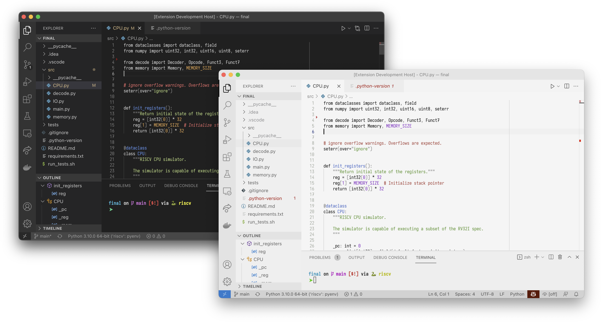

# Alabaster Variant theme

This theme is inspired by the motivation of [Tonsky's Alabaster](https://github.com/tonsky/sublime-scheme-alabaster). In fact, most of the light variant of this theme is lifted from [his own extension](https://marketplace.visualstudio.com/items?itemName=tonsky.theme-alabaster). I decided to make this theme for two main reasons:

1. I was irritated that there wasn't a single extension providing both a light and dark variant that were consistent. 

> While the themes provided here are not entirely consistent 😅, at least not while they are in their infancy, light and dark themes are both available.

2. I didn't like the UI color scheme for existing extensions.

> I'm not generally a fan of "flattening" the UI scheme; Where many UI elements have the same background color. Nor am I a fan of "tinted" themes, where the base color has some color. The themes provided here have non-tinted themes, where the elements are separated rather than flattened.

